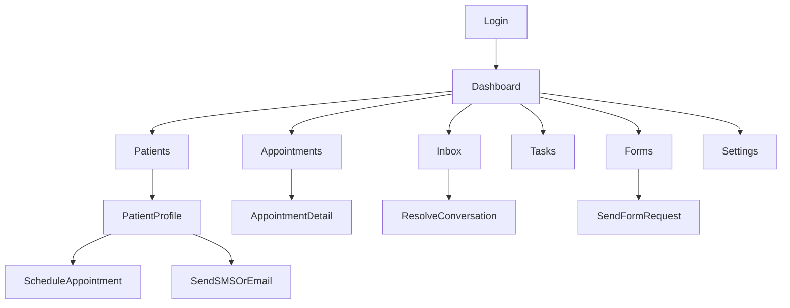

# Front-Desk CRM User Guide

This guide is for new front-desk staff using the CRM day to day.
It is written so you can walk through the app on your own, screen by screen.

## What This Guide Covers

- Staff CRM workflows only (not patient portal).
- Deduplicated from both app trees in this repository.
- Canonical UI and labels are based on the current root app at `src/...`.

## Before You Start

- Open the app and go to `/login`.
- Sign in with your email.
- Click **Send sign-in link** and open the link sent to your inbox.
- After sign-in, you should land on **Dashboard**.

If sign-in fails:
- If you see **Could not send sign-in link.**, try again with the same email.
- If you see a configuration error, contact your admin (this is usually setup-related).

## Know Your Navigation

Main left sidebar items:
- **Dashboard**
- **Analytics**
- **Patients**
- **Appointments**
- **Tasks**
- **Inbox**
- **Forms**
- **Marketing**
- **Calls**
- **Workflow Automations**
- **Settings**

Notes:
- **Inbox** may show an unread badge.
- **Sign Out** is at the bottom of the sidebar.

## How Workflows Connect

## Start-Of-Shift Checklist (10 Minutes)

1. Open **Dashboard**.
2. Review **Today's Appointments** and **Next 7 Days** cards.
3. Check **Needs Follow-up** and open any patient needing outreach.
4. Review **My Tasks** card for overdue or today items.
5. Open **Inbox** and clear urgent unread conversations first.

Expected results:
- You know what is booked today.
- You know which patients need follow-up.
- You have a prioritized task and inbox queue.

## Workflow 1: Find or Add a Patient

### Find an existing patient

1. Click **Patients**.
2. Use search in the patient directory.
3. Open a patient record from the list.

If you do not find them:
- Confirm spelling and phone/email search.
- If still missing, add them as a new patient.

### Add a new patient

1. In **Patients**, click **Add Patient**.
2. Enter required demographic/contact information.
3. Save the patient.
4. Confirm you are redirected to the patient profile.

Success check:
- Patient profile opens.
- Patient appears in **Recent Patients** and in patient search.

## Workflow 2: Update Patient Details, Notes, and Insurance

From a patient profile (`/patients/[id]`), use tabs and right-side actions.

### Update patient details

1. Open the patient profile.
2. Click the edit action in **Basic Information**.
3. Update fields and save.

If data is missing, placeholders may show:
- **No email address**
- **No phone number**

### Manage notes

1. On patient profile, click **Manage Notes**.
2. Add note type and note content.
3. Save.

Common issues:
- **Failed to load notes**
- **Failed to save note**
- **Failed to delete note**

### Manage insurance

1. Open the **Insurance** tab.
2. Click **Add Insurance**.
3. Fill payer/policy/subscriber details.
4. Save and verify status.

What to expect:
- Policies show with readiness indicators.
- If none exist, you will see **No insurance policies yet**.

## Workflow 3: Schedule and Manage Appointments

### Schedule from patient profile (recommended)

1. Open a patient profile.
2. Go to **Appointments** tab.
3. Click **Schedule Appointment**.
4. Select **Visit Type**.
5. Pick a date in calendar.
6. Pick an available time.
7. Optionally add **Reason / Notes**.
8. Click **Schedule Appointment**.

Success check:
- You return to the patient page.
- Appointment appears in patient appointment list and **Appointments** page.

### Manage from appointments page

1. Open **Appointments**.
2. Use **List** or **Calendar** view.
3. Filter by search, status, and date.
4. Open any appointment to view details.

Common issues and what to do:
- **No visit types available...**: ask admin to map Cal event types in **Settings -> Cal.com Integration**.
- **No available time slots for this date...**: choose another date.
- **No appointments found**: clear filters.

## Workflow 4: Send and Resolve Communications (Inbox)

### Work the inbox

1. Open **Inbox**.
2. Use left filters: **Open**, **Pending**, **Resolved**, **Mine**, **Team**.
3. Select a conversation.
4. Read timeline and send response from composer.
5. Click **Resolve** when complete.

### Start a new conversation

1. In conversation list, click **New**.
2. Select patient and channel.
3. Write message and send.

What to expect:
- Empty queue shows **Inbox Zero**.
- Conversation header may show **Assign** if unassigned.
- Missing patient contact data can show **No email** or **No phone**.

If send fails:
- You may see **Message failed to send. Try again.**
- Retry once, then check integration setup in **Settings** if repeated.

## Workflow 5: Create and Track Tasks

1. Open **Tasks**.
2. Click **New task**.
3. Add title and optional details/record links.
4. Assign owner and due date.
5. Save.

Daily usage:
- Use date groups (**Overdue**, **Today**, **Tomorrow**, **Upcoming**).
- Mark complete using the checkbox.
- Open a task title to view/edit details.

If list is empty:
- You will see **No tasks yet!** and a **New task** action.

## Workflow 6: Send Intake Forms to Patients

1. Open **Forms**.
2. Click **Send form** or **Send intake form**.
3. Select **Patient**.
4. Select **Form template**.
5. Optionally set due date/message.
6. Choose notification channel (Email, SMS, or Do not notify).
7. Select a notification template if using Email/SMS.
8. Click **Send form**.

Success check:
- Form request appears in **Recent Requests**.

Common issues:
- **Select a patient and a form template.**: required fields missing.
- **Select a notification template...**: channel selected without template.
- **Form created but notification failed: ...**: request is created; retry communication separately.
- **No published email/SMS templates found. Create one in Marketing -> Templates.**: create templates first.

## Settings: When Front Desk Should Use It

Most integration setup is admin-owned, but front desk should know where to point issues:
- **Settings -> API Configuration**
  - Cal.com Integration
  - RetellAI
  - SendGrid
  - Twilio

Escalate to admin when you see repeated integration errors during:
- appointment slot loading/booking
- SMS sending
- email sending

## Known Boundaries (So You Avoid Dead Ends)

- There is currently no full front-desk billing/invoice module in the active staff UI.
- Use patient notes/insurance/timeline for billing-adjacent tracking until billing screens are added.

## Quick Reference: Where To Click

- Add new patient: `Patients -> Add Patient`
- Open patient profile: `Patients -> select patient`
- Schedule appointment: `Patient profile -> Appointments -> Schedule Appointment`
- View all appointments: `Appointments`
- Reply to messages: `Inbox -> select conversation -> send`
- Create task: `Tasks -> New task`
- Send intake form: `Forms -> Send form`
- Configure integrations (admin): `Settings -> API Configuration`
- Sign out: `Sidebar bottom -> Sign Out`

## First Week Self-Check

By the end of week one, you should be able to do these without help:
- Start shift from Dashboard and prioritize work.
- Add and update patients reliably.
- Book appointments and recover from no-slot situations.
- Clear Inbox and resolve conversations.
- Create and close tasks.
- Send intake forms and interpret request/notification outcomes.
